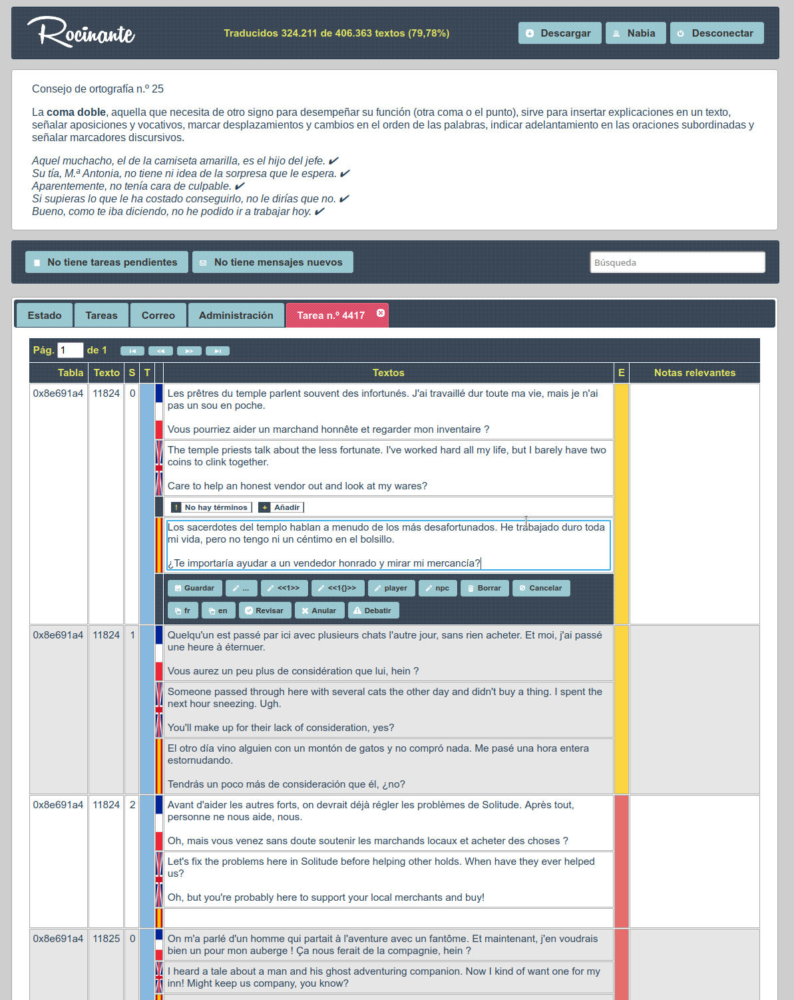
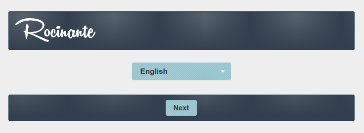
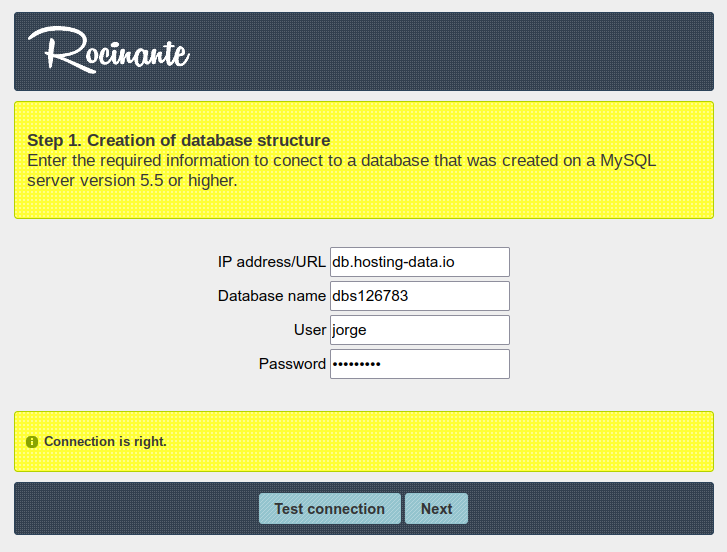
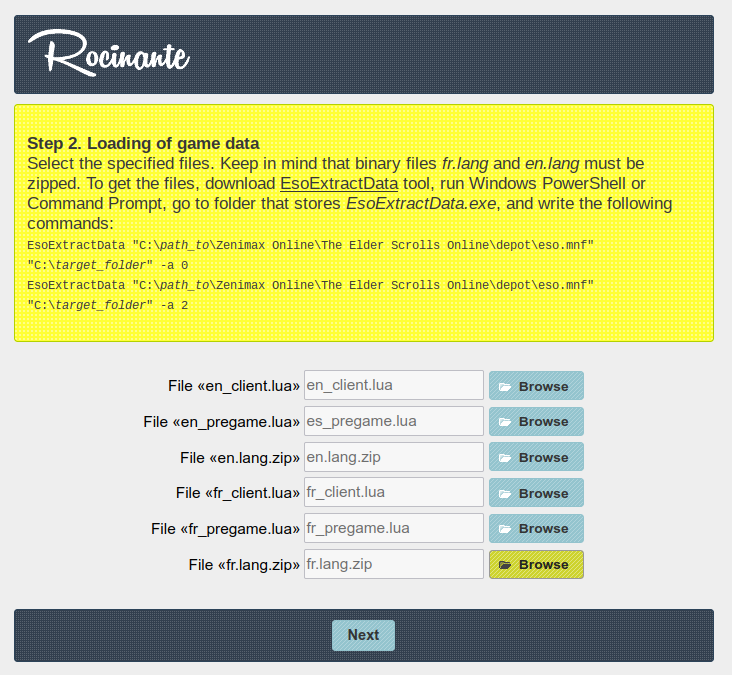
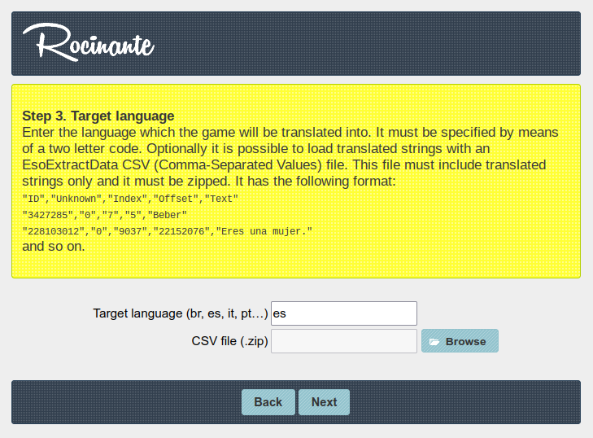
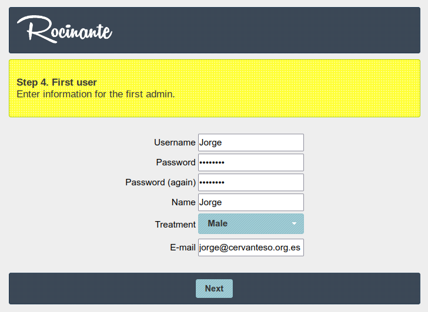
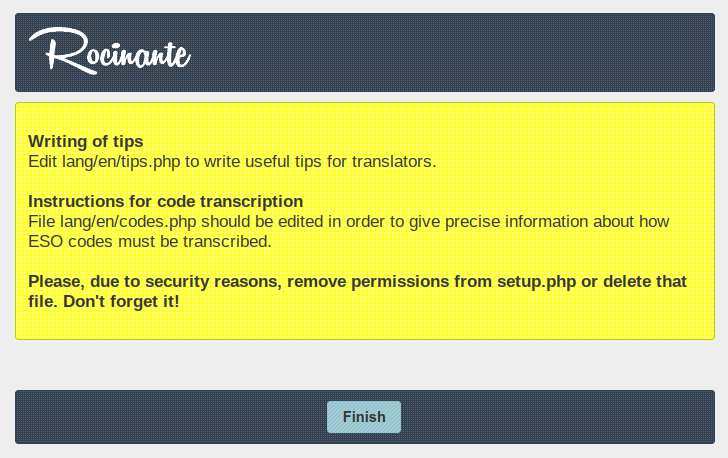
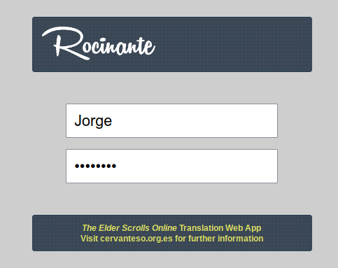

### The Elder Scrolls Online® Translation Web App

Rocinante is the web application Cervanteso used for eight years to translate the computer game The Elder Scrolls Online®. Cervanteso was a group of professional and amateur translators who translated the most part of the game into Spanish until Zenimax Online Studios® released its official translation on June 6, 2022.

    
Although Rocinante was developed keeping in mind Spanish as target language, it can be used for any other one. In fact, Rocinante was deployed years ago to help Brazilian community to translate the game into Portuguese. However, the web app is no longer maintained. 

# Disclaimer

THIS MATERIAL IS NOT MADE, GUARANTEED OR SUPPORTED BY ZENIMAX OR ITS AFFILIATES.

# Setup

Rocinante has a wizard to help you to install it on a web server. First and foremost, be sure your web server meets these **requirements**:
  - It runs on Linux.
  - PHP 7.4 is available. Probably a higher version will work, but it's not tested.
  - MySQL 5.7 is available. Same as above.
  - It's accessible via SSH.
  - A C++ compiler and `make` are available.

Follow these instructions to install Rocinante. **Disclaimer: I do not assume any liability for possible emerging "damages" or subsequent "damages" during or after installation.**
1. Download Rocinante from [here](https://github.com/helmantika/rocinante/releases/tag/v1.0.0) (tar.gz file).
2. Upload Rocinante to the server with `scp` or any other way. For instance:
 
   `scp rocinante-1.0.0.tar.gz u89502474@home000000000.1and1-data.host:/kunden/homepages/00/0000000000/htdocs/`
3. Access the web server via SSH.

   `ssh u89502474@home000000000.1and1-data.host`
4. Move the file into a new folder. I'll assumme the name of this folder is `rocinante`.

   `mkdir rocinante && mv rocinante-1.0.0.tar.gz rocinante/`
5. Decompress the file

   `tar zxvf rocinante-1.0.0.tar.gz`.
6. Change to directory `rocinante/cgi-bin/addon`.
7. Build `addon` program:

   `./configure && make && mv src/addon ../addon.cgi`
9. Change to directory `rocinante/cgi-bin/dumper`.
10. Build `dumper` program:

    `./configure && make && mv src/dumper ../dumper.cgi`
11. Check whether `addon.cgi` and `dumper.cgi` are in `rocinante/cgi-bin`. Now you can delete directories `rocinante/cgi-bin/addon` and `rocinante/cgi-bin/dumper`
12. The hardest part is done. Now you can exit from the server.
13. Create a new MySQL database and write down its name, URL, user, and password. The wizard will require you this information.
14. Run a web browser and open setup.php. For instance: https://www.example.com/rocinante/setup.php. You should see something like this:

    
15. Rocinante's wizard is available in Spanish, Portuguese, and English. Choose one and click on Next.
16. Enter the information of the database and click on Test Connection. If everything is fine, click on Next.

    
17. Follow the instructions of the screen to load mandatory game files.

    
18. Set the target language.

    
19. Click on Next. Rocinante will start to populate the database. This process will take long because the amount of information is huge. More than 8,000,000 words!
20. Enter the information for the first administrator. An administrator has permission to do everything: create and remove users, generate the add-on, update the database, etc.

    
21. The last screen suggests task to do after installing Rocinante. Remember to **delete setup.php** file. Also, you must **set read and executable permission just for the owner of config folder** (500): `chmod 500 config`

    
22. Access Rocinante with your credentials.

    

# Documentation

Rocinante's translator manual (75 pages) is available [here](https://github.com/helmantika/rocinante/tree/main/doc/Manual%20del%20traductor). Unfortunately, it's only available in Spanish.
